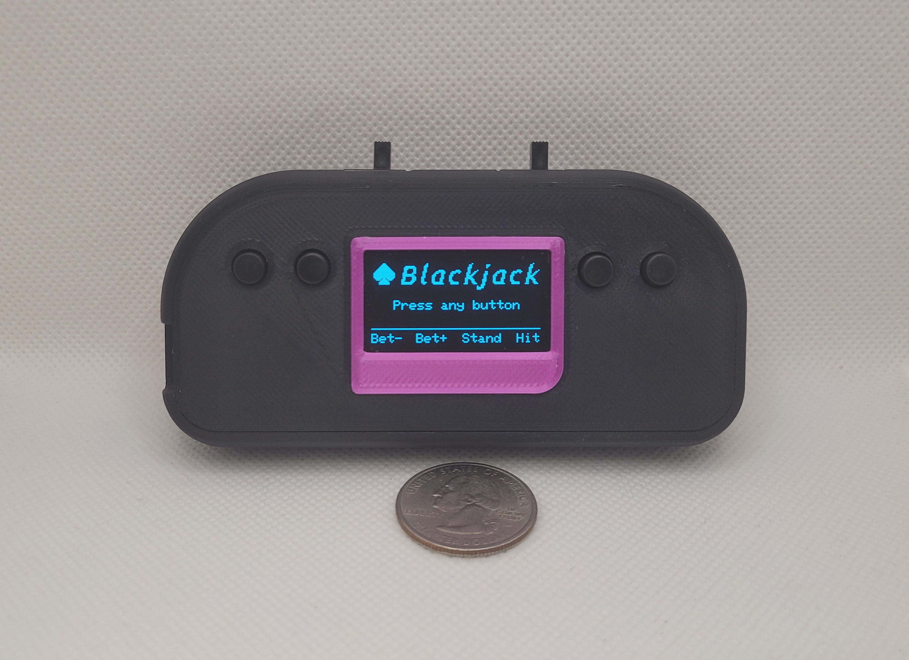
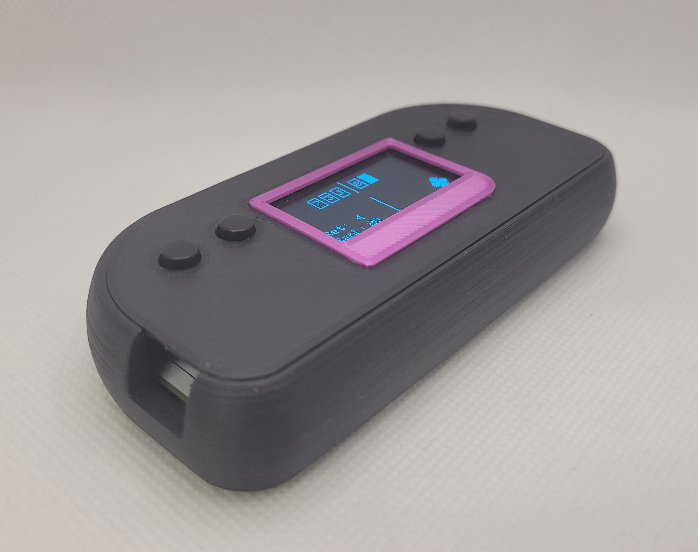

## Arduino_Blackjack_Handheld

This handheld Blackjack game uses an Arduino Nano, a 1.3" 128x64 I2C OLED display, and a four-button interface. It features card animations, a betting and bankroll system, 2-to-1 Blackjack payouts, double down bets, and other player-friendly details.

I tried to make this project as compact and user-friendly as possible. It uses only six data pins and no resistors are needed.

Note that the [OLED panel](https://www.sunfounder.com/products/1-3-iic-i2c-serial-128x64-ssh1106-oled-display-module) uses the SH1106 display controller, which requires a different library than SSD1306 panels. You can download the library [here](https://github.com/wonho-maker/Adafruit_SH1106).

Watch a longer [video demo](https://www.youtube.com/watch?v=bv6VOLqCWfE) on Youtube.

---

**Wiring**

| Pin    | Component                  |
|:-------|:---------------------------|
| D3     | Button D                   |
| D5     | Button C                   |
| D7     | Button B                   |
| D9     | Button A                   |
| A4/SDA | OLED SDA                   |
| A5/SCL | OLED SCL                   |
| 3.3V   | OLED VCC                   |
| GND    | Connect to all components. |

---

I turned the project into a true handheld with a small LiPo battery and USB-C charging. It's a lot of fun. Overall dimensions are about 4-1/8 x 1-7/8 x 3/4 inches.

